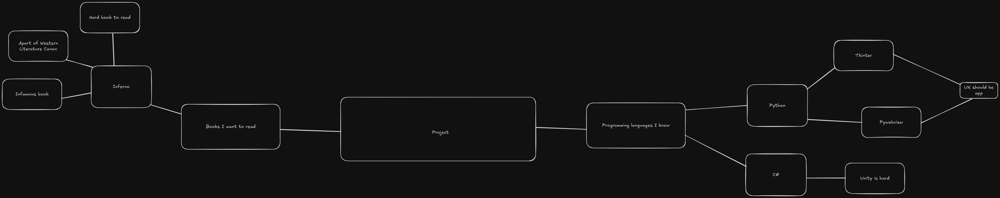

# Design Brief

---

## Book Choice and Justification

---

The book I have chosen is Inferno by Dante Alighieri, the first third of 'The Commedia' (Now known as the divine comedy), in summary Inferno has Dante guided through Hell by Virgil (Who I believe was another famous writer/poet) where they venture through every layer seeing popular figures from mythology as well as some more familiar faces for Dante (his political rivals). The reason a chose this book was mostly to give myself a reason to get back to reading it, but for the project the reason I chose it was because Inferno is generally considered a difficult book to read despite it being a part of the western literature canon (a group of extremely influential pieces of literature across history), hence it would be useful to simplify it for a broader audience.

---

## UX Type

---

The experience will likely take the form of (more or less) an application (via python), this is mostly due to the fact that creating so many sprites for an all out game is incredibly difficult, and I lack skills in sprite creation. The simple format will allow the reader to understand the book part by part allowing the reader to understand the story and general themes without having the regular reading ability required to read the book.

---

## Target Market

---

The target audience are those who do not have a high enough reading level to properly understand the intricacies of the book but still wish to understand the general story and ideas behind it, this is project would appeal to such a group as it is catered directly towards their needs, giving the required information without the level of reading required to understand such a significant classic.

---

## Software and Tools

---

I intend on using python for this project, notably using the tkinter module. I have chosen python due to my large amount of experience with it and its many modules, hence I believe python is suitable for this project, to further support this choice there is reasonable possibility to learn Flask and possibly create a website via the use of Python...

---

## Initial Brainstorming

---

As you can see, I looked at what feasible options I had, and made a choice.
