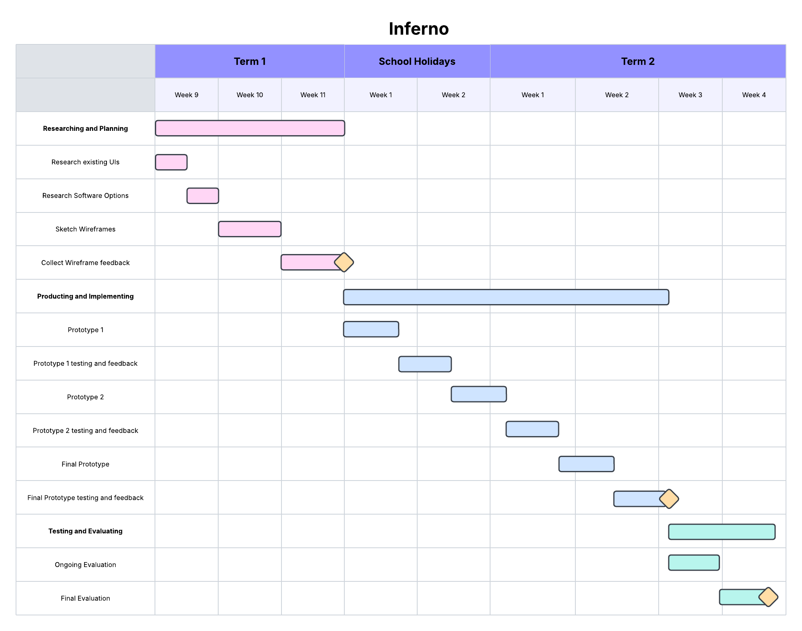

# Researching and Planning

---
---
---

## Gnatt Chart

---
---

---
---

## Research Existing UIs

---
---

|UI Name|Plus|Minus|Implication|
|-|-|-|-|
|Google Classroom|It isn't congested with too many buttons and/or frames with extra options that aren't nessecarily always required being collapsible to allow focus upon the main content of the UI (Assignments, Announcements, etc.). It is also engineered for convenience giving potentially useful reminders about upcoming assignments and gives quick links for teachers who want to use more off-platform programs instead. Along with the ability to hid unused, unarchived classes and many other features which allow for the simplification of the UI.|The most notable issue with the Google Classroom UI is the outright lack of an easily accessible dark mode with a dark mode solely existing for the mobile app and not the (arguably more commonly used) website, instead you'd have to download a chrome extension to do so which is often not even possible due to the Department of Education preventing school accounts from downloading chrome extensions. Other then that any issues are very minor.|The Google Classroom UI is an incerdibly good example of such (as you'd expect from a multi-billion dollar company), It would be a good idea to replicate it's overall capability of optional minimisation of anything that may distract from the main content of the UI, however importantly it must not replicate it's mistake and actually have a dark mode for users who view the site under a harsh lighting.|
|Ublock₀ Dashboard|The Ublock₀ Dashboard is very simplistic and straight to the point looking like something that could easily be made with tkinter. It contains simple checkboxes along with some options menus and entry points across several tabs however it majorly lacks aesthetically and does not explain many of the more particular features instead linking to a different website instead. It's easy to navigate but difficult to fully understand.|As mentioned in the 'Plus' section it severely lacks aesthetically looking like as if it was made with tkinter with little to no actual customization, it also puts absolutely no effort in explaining what so many buttons do, even if the navigation is intuitive it's almost useless without any explanation of what the user is actually doing, and it lacks a dark mode.|There is a lot to improve upon, most notably it requires massive aesthetic upgrades as it completely lacks any attempt at it, and it isn't entirely accessible and still lacks a dark mode, however it is a useful scaffold for what I could design via tkinter and it's navigation is rather intuitive and easily replicable.|
|Gosford High School Gitbook|The Gosford High School Gitbook has a reasonable UI, it is indeed easy to navigate and most tabs fall under one category preventing potential clutter, there is some degree of aesthetics however some pages are just walls of text, the year 10 sections is aesthetically much worse than the year 9 section.|To begin simply the aesthetics are simply inconsistent across the website, some categories will have an image in every tab whilst others will lack any altogether, especially in the year 10 section, it also suffers from a lack of a dark mode.|It's navigation system can be replicated but mistakes such as inconsistent aesthetics and the lack of a dark mode can be fixed to overall better the final UI|

---
---

## Research Software Options

---
---

|Software Option|Plus|Minus|Implication|
|-|-|-|-|
|Python (Tkinter)|I have a lot of prior experience with tkinter, hence it is easy for me to use, it also has many modules created for it that massively improve it limitations and it conveniently fits in with the purpose with features such as scrollbars and easy ways to position images.|Tkinter still has its limitations, notably it is incredibly limited in terms of accessing html and creating anything even slightly complex with tkinter becomes incredibly convoluted very quickly.|Tkinter is very much a viable option given my prior experience, however there are most certainly better options that would require more knowledge but for a better result.|
|Python (Flask)|Flask is much more complex than modules such as tkinter giving it much less limitations allowing for more complex things to be made, it can be used to turn it into a proper website rather than just a GUI without all the issues of having to learn an entirely new bit of software.|Flask is extremely complex and I have little to no experience with it and is known to be rather difficult to learn and use, it also requires an understanding of coding in html, javascript and CSS.|Flask is a superior option to most but it would require much more learning to be capable of creating a proper website, however I am confident in my abilities and believe that this may become a viable option with due time.|
|Adobe XD|Adobe XD is specifically made for UI and UX design and has many quality of life features and is relatively easy to use with a sufficient understanding of its features.|I have almost no experience with Adobe XD hence it would require a great deal of time to properly learn, Adobe XD also is no longer recieving updates hence there is no hope for an improvement of the software. It's also an Adobe product.|Although Adobe XD could potentially be used I'd rather not use it due to my overall lack of knowledge wit it and Adobe.|

---
---

## Wireframes

---
---
